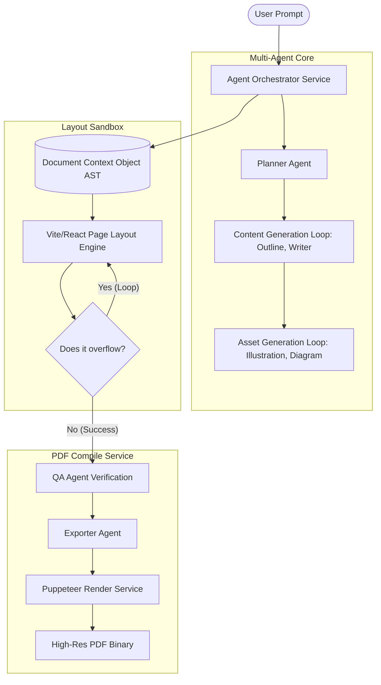
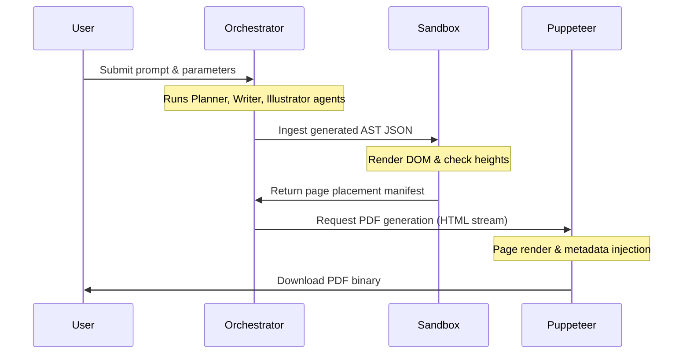

# ARCHITECTURE.md — System Topology & Agent Orchestration Architecture

This document specifies the system-wide architecture of the AI Publishing Engine. It defines microservice borders, agent communications, data flow sequences, and runtime interfaces.

---

## 1. Purpose
The purpose of this document is to detail the technical design and interaction patterns of the multi-agent orchestration layer, the Page Layout Sandbox, and the Puppeteer PDF generation microservice. It provides the definitive system schema for coding agents implementing backend and frontend modules.

---

## 2. Goals
* Establish boundaries between the asynchronous Agent Orchestrator and the synchronous layout and compilation runtimes.
* Define a multi-agent processing pipeline (Planner -> Research -> Outline -> Writer -> Illustration -> Diagram -> Typography -> Layout -> Consistency -> QA -> Exporter -> Canvas).
* Detail the system-wide state model (Document Context Object) for context propagation.
* Provide retry strategies for LLM connection drops or execution faults.

---

## 3. Non-Goals
* **No Database Schema Details**: Does not specify relational column models (delegated to [DATABASE_SCHEMA.md](file:///.agent/DATABASE_SCHEMA.md)).
* **No CSS Layout Token details**: Does not define margin scales or color lists (delegated to [DESIGN_SYSTEM.md](file:///.agent/DESIGN_SYSTEM.md)).

---

## 4. Architecture
The runtime workflow is divided into three separate microservices that communicate via REST APIs and WebSockets/SSE:

---

## 5. Responsibilities
* **Orchestrator Service**: Manages LLM agent runtimes, logs transaction outputs, and runs validation handshakes.
* **Layout Sandbox Service**: Runs inside a browser instance, rendering AST nodes to absolute coordinates.
* **PDF Compiler Service**: Launches Puppeteer tabs, intercepts styles, handles font injection, and compiles the PDF binary.

---

## 6. Dependencies
* **Libraries**: `puppeteer` (rendering), `pdf-lib` (metadata injection and bookmarks structure).
* **Specifications**: Binds directly to [DOCUMENT_MODEL.md](file:///.agent/DOCUMENT_MODEL.md) for AST parameters.

---

## 7. Constraints
* **Compile Window**: Total execution time must not exceed 90 seconds.
* **Isolated Environment**: The Puppeteer rendering sandbox must run with networking disabled after initial script loading to prevent SSRF vulnerabilities.
* **Single Thread Layout**: Sandboxed geometry measurements must run on a single browser thread.

---

## 8. Naming Conventions

### Microservices
* Agent Orchestration Module: `/services/orchestrator`
* Puppeteer Rendering Module: `/services/compiler`
* React Sandboxing App: `/apps/layout_sandbox`

### APIs
* Status Streams: `/api/v1/documents/:id/progress` (SSE)
* PDF Compilation Trigger: `/api/v1/documents/:id/export` (POST)

---

## 9. Folder Structure
The implementation paths map as follows:
* `/services/orchestrator/src/agents/` — contains Agent configurations.
* `/services/compiler/src/printer.ts` — contains Puppeteer API integration.

---

## 10. Design Decisions

### Browser Sandbox for Spacing Calculations
* **Decision**: We run real browser instances (Puppeteer/Chromium) to check text dimensions instead of mathematical text bounding estimates.
* **Rationale**: Accurate text line heights are highly dependent on font rendering engines, kerning rules, and browser anti-aliasing. Mathematical character count estimates are inaccurate for serif fonts. Using Chromium ensures the rendering metrics match the output PDF.

---

## 11. Future Extensibility
* **New Compilation Engines**: The `/services/compiler` interface abstracts standard PDF generation. Developers can insert alternate render engines (e.g. Typst or Weasyprint) by matching the REST export endpoint without editing the core agent loop.

---

## 12. Implementation Guidance
1. Ensure the orchestrator writes every intermediate agent step payload to the database.
2. Build the layout sandbox to support a raw JSON AST import route (`/sandbox?document_id=...`).
3. Set up Puppeteer to launch with a pool of hot browser tabs to minimize startup times.

---

## 13. Acceptance Criteria
* The compilation pipeline executes from planning to PDF generation under 90 seconds.
* Tab crashes in the browser pool do not affect the main orchestrator process.
* Running out of space on page 3 triggers a layout recalculation event.

---

## 14. Common Mistakes
* **Coupling Content to Styles**: Having the Writer Agent generate style overrides or CSS attributes.
* **Spawning Browsers on Demand**: Launching a fresh Chromium process for every PDF request, adding up to 2 seconds of overhead.

---

## 15. Examples

### Complete Compilation Sequence Diagram

---

## 16. Decision Records

### ADR-003: Puppeteer Browser Tab Pooling
* **Status**: Approved.
* **Context**: Spawning fresh browser instances on every export request causes latency issues.
* **Decision**: Maintain a persistent pool of 3 warm Chromium processes, recycling tabs instead of instances.
* **Consequence**: Cuts PDF compilation start times from 2 seconds to under 300ms.

---

## 17. References to Related Files
* See [DOCUMENT_MODEL.md](file:///.agent/DOCUMENT_MODEL.md) for AST structural schemas.
* See [PDF_ENGINE.md](file:///.agent/PDF_ENGINE.md) for compiler setup parameters.
* See [DATABASE_SCHEMA.md](file:///.agent/DATABASE_SCHEMA.md) for persistence mapping.
