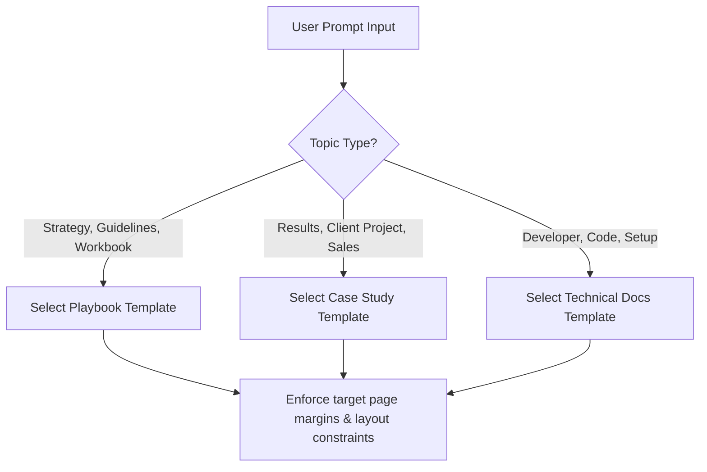

# TEMPLATE_SYSTEM.md — Predefined Document Template Configurations

This document specifies the default page templates and structure plans for our target publications. The Planner Agent maps user requests to these structures, and the Layout Sandbox applies them during compilation.

---

## 1. Document Structure Templates

### Template A: Business Playbook & Guide
Designed for internal training, playbooks, strategy guides, and handbooks. Focuses on checklists and readability.

```
Page 1: CoverPage (Editorial Asymmetric Layout)
Page 2: Table of Contents (Right-aligned dot leaders)
Page 3: Chapter 1: Strategic Vision (Large PullQuote + 2-Column text)
Page 4: Chapter 2: Operational Steps (H2 + 3-Card Info Grid)
Page 5: Action Items Worksheet (12-Row Checklist + blank lines)
Page 6: BackCover (Minimalist dark surface, logo, metadata barcode)
```

### Template B: Case Study & Proposal
Designed for business analysis, proposals, and customer success stories. Focuses on metrics and social proof.

```
Page 1: CoverPage (Geometric Minimal Layout)
Page 2: The Challenge (H2 + 2-Column layout: Problem statement next to Callout Box)
Page 3: The Solution (H2 + Full-page technical architecture illustration SVG)
Page 4: The Impact (DataGrid: 3-column metric cards + comparison table)
Page 5: Testimonial & Next Steps (PullQuote + Callout Box with call-to-action)
Page 6: BackCover (Corporate layout, contact coordinates)
```

### Template C: Technical Product Brief & Documentation
Designed for developer guides, system API briefs, and technical setup sheets. Focuses on code blocks and checklists.

```
Page 1: CoverPage (Asymmetric Technical Style)
Page 2: Table of Contents (Single-column clean list)
Page 3: Quick Start Guide (H2 + CodeBlock with syntax styling)
Page 4: Core Routing Engine (H2 + Flowchart Diagram SVG + paragraphs)
Page 5: API Specification Table (DataGrid details for endpoints + callouts)
Page 6: FAQ & Troubleshooting (2-Column accordion-style layout)
Page 7: BackCover (Minimalist dark layout, version logs)
```

---

## 2. Template Selection Rules

The Planner Agent maps the user's prompt to a template using this decision logic:



---

## 3. Custom Layout Generation Specifications

If the user request does not match any predefined template, the system falls back to **Custom Synthesis Mode**:
1. **Chapter Partitioning**: The Planner divides the text copy into equal weight chunks.
2. **Page Estimation**: Evaluates paragraph character bounds using the estimation formula in `PAGE_LAYOUT_ENGINE.md`.
3. **Element Insertion**: Randomly maps illustration boxes or callouts inside pages to balance layout density.
4. **Visual Rhythm Calibration**: Inserts section breaks and page markers to ensure visual rhythm.
