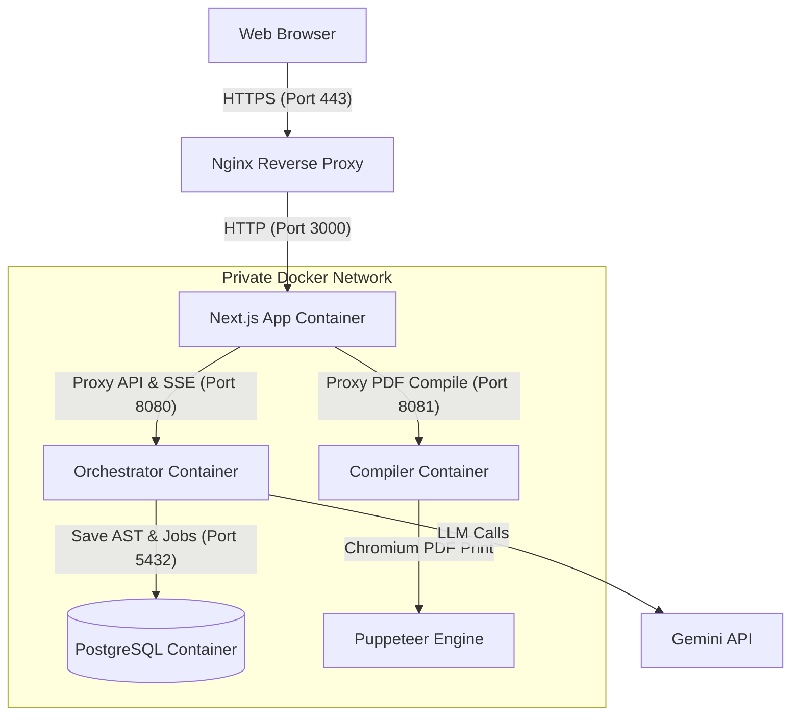

# Vibe-PDF Deployment Guide: Oracle Cloud VPS

This guide provides a step-by-step walkthrough to deploy the **Vibe-PDF Builder** platform to a Virtual Private Server (VPS) on **Oracle Cloud Infrastructure (OCI)**. 

Our architecture consists of:
1. **Next.js Web App (`apps/web`)** — Port `3000` (exposes public routes and acts as a gateway)
2. **Orchestrator Service (`services/orchestrator`)** — Port `8080` (coordinates multi-agent planning & execution)
3. **Compiler Service (`services/compiler`)** — Port `8081` (Puppeteer & Chromium PDF printer)
4. **PostgreSQL Database** — Port `5432` (relational storage for jobs, documents, and ASTs)

Only the **Next.js Web App** is exposed publicly. The DB, Orchestrator, and Compiler operate on a private network bridge inside Docker, ensuring maximum security.

---

## 🗺️ System Architecture



---

## 🛠️ Step 1: Oracle Cloud Compute & Network Setup

Oracle Cloud instances (both AMD and ARM64 A1 Shapes) have strict ingress rules and an additional OS-level firewall blocking ports by default.

### 1.1 OCI Ingress Rules (Web Dashboard)
1. Go to your **OCI Console** -> **Compute** -> **Instances**.
2. Click on your Instance -> Under **Instance details**, click on your **Virtual Cloud Network (VCN)**.
3. Click on **Security Lists** -> Click on your **Default Security List**.
4. Click **Add Ingress Rules** and add the following two rules:
   * **Rule 1 (HTTP)**:
     * **Source CIDR**: `0.0.0.0/0`
     * **IP Protocol**: `TCP`
     * **Destination Port Range**: `80`
     * **Description**: `Allow HTTP traffic`
   * **Rule 2 (HTTPS)**:
     * **Source CIDR**: `0.0.0.0/0`
     * **IP Protocol**: `TCP`
     * **Destination Port Range**: `443`
     * **Description**: `Allow HTTPS traffic`

### 1.2 Host-Level OS Firewall (SSH Console)
By default, Oracle Linux and Ubuntu instances use `iptables` rules that block all incoming traffic. Log into your VPS via SSH and run:

```bash
# Allow HTTP and HTTPS through the local firewall
sudo iptables -I INPUT 6 -p tcp --dport 80 -j ACCEPT
sudo iptables -I INPUT 6 -p tcp --dport 443 -j ACCEPT

# Save the iptables rules so they persist across restarts
sudo netfilter-persistent save
sudo netfilter-persistent reload
```

---

## 📦 Step 2: Install Docker and Docker Compose

Run the following commands on your VPS to set up Docker's official repository and install the runtime:

```bash
# Update package database
sudo apt update && sudo apt upgrade -y

# Install prerequisite packages
sudo apt install -y ca-certificates curl gnupg lsb-release

# Add Docker's official GPG key
sudo mkdir -p /etc/apt/keyrings
curl -fsSL https://download.docker.com/linux/ubuntu/gpg | sudo gpg --dearmor -o /etc/apt/keyrings/docker.gpg

# Set up the stable repository
echo \
  "deb [arch=$(dpkg --print-architecture) signed-by=/etc/apt/keyrings/docker.gpg] https://download.docker.com/linux/ubuntu \
  $(lsb_release -cs) stable" | sudo tee /etc/apt/sources.list.d/docker.list > /dev/null

# Install Docker Engine and Compose
sudo apt update
sudo apt install -y docker-ce docker-ce-cli containerd.io docker-compose-plugin

# Enable and start Docker service
sudo systemctl enable docker
sudo systemctl start docker

# Add your user to the docker group (to run docker without sudo)
sudo usermod -aG docker $USER
newgrp docker # Reload shell session
```

---

## 🔑 Step 3: Clone Code and Configure Environment

1. Clone your repository onto the VPS:
   ```bash
   git clone https://github.com/swarnendu19/Vibe-PDF.git
   cd Vibe-PDF
   ```

2. Create a production `.env` file in the root folder:
   ```bash
   nano .env
   ```

3. Paste the following configuration, filling in your actual API keys and domain details:
   ```env
   # ── Database Credentials (Matches docker-compose) ───────────────────────────
   # (Change the password below to a strong random string)
   DATABASE_URL="postgresql://postgres:postgres_secure_pass_change_me@db:5432/publishengine"

   # ── AI API Credentials ──────────────────────────────────────────────────────
   # Used by the Orchestrator service to plan and compile document content
   GOOGLE_GENERATIVE_AI_API_KEY="AIzaSyYourGeminiApiKeyHere"
   # Optional:
   # OPENAI_API_KEY="sk-..."
   # ANTHROPIC_API_KEY="sk-..."

   # ── Web App & Gateway URLs ─────────────────────────────────────────────────
   # Replace with your actual domain name
   NEXT_PUBLIC_APP_URL="https://yourdomain.com"
   ```

---

## 🚀 Step 4: Build and Boot Containers

Start the build process. Since Next.js requires compiling and code-splitting, this step might take 2-4 minutes depending on your VPS capabilities.

```bash
# Start compiling and running containers in detached mode
docker compose up -d --build
```

### Verify Service Health
Use Docker commands to check that all four containers are running and healthy:

```bash
# List running containers
docker compose ps

# Check the build/run logs of the containers
docker compose logs -f
```

---

## 🔒 Step 5: Reverse Proxy & Let's Encrypt SSL (HTTPS)

We will use **Nginx** as our reverse proxy on the host to route public domain requests to our Next.js application running in Docker (port 3000), and **Certbot** to automatically provision and renew Let's Encrypt SSL certificates.

### 5.1 Install Nginx & Certbot
```bash
sudo apt install -y nginx certbot python3-certbot-nginx
```

### 5.2 Configure Nginx
1. Create a site configuration file:
   ```bash
   sudo nano /etc/nginx/sites-available/vibe-pdf
   ```

2. Paste the following boilerplate config (ensure you change `yourdomain.com` to your actual domain):
   ```nginx
   server {
       listen 80;
       server_name yourdomain.com; # Change to your domain

       client_max_body_size 50M;

       location /.well-known/acme-challenge/ {
           root /var/www/html;
       }

       location / {
           proxy_pass http://localhost:3000;
           proxy_http_version 1.1;
           proxy_set_header Upgrade $http_upgrade;
           proxy_set_header Connection 'upgrade';
           proxy_set_header Host $host;
           proxy_cache_bypass $http_upgrade;
           proxy_set_header X-Real-IP $remote_addr;
           proxy_set_header X-Forwarded-For $proxy_add_x_forwarded_for;
           proxy_set_header X-Forwarded-Proto $scheme;

           # SSE streaming configuration
           proxy_buffering off;
           proxy_read_timeout 600s;
           proxy_send_timeout 600s;
       }
   }
   ```

3. Enable the configuration and test Nginx:
   ```bash
   # Enable by symlinking to sites-enabled
   sudo ln -s /etc/nginx/sites-available/vibe-pdf /etc/nginx/sites-enabled/

   # Remove default nginx site to avoid routing conflicts
   sudo rm -f /etc/nginx/sites-enabled/default

   # Verify syntax is correct
   sudo nginx -t

   # Reload Nginx
   sudo systemctl reload nginx
   ```

### 5.3 Request Free SSL Certificate
Use Certbot to secure Nginx automatically:
```bash
sudo certbot --nginx -d yourdomain.com
```
*Follow the on-screen prompts to register an email and accept Terms of Service. Certbot will fetch the certificate and automatically update the Nginx configuration to enable HTTPS and force redirect HTTP traffic.*

Verify that the Certbot automatic renewal cron is active:
```bash
sudo systemctl status certbot.timer
```

---

## 💡 Step 6: Troubleshooting & Performance Tips

### 6.1 RAM Constraints on Small Instances
If you are deploying on a small AMD instance with **1 GB RAM**, the build stage (`next build`) or Puppeteer runs might crash with `OutOfMemory` errors. 

**Solution**: Set up a Swap file to supplement the memory.
```bash
# Allocate 2GB Swap file
sudo fallocate -l 2G /swapfile
sudo chmod 600 /swapfile
sudo mkswap /swapfile
sudo swapon /swapfile

# Make swap persistent
echo '/swapfile none swap sw 0 0' | sudo tee -a /etc/fstab
```

### 6.2 Inspecting Chromium Issues in PDF Compiler
If PDF export returns 500 errors, check the logs of the compiler container to verify Puppeteer is connecting to Chromium successfully:
```bash
docker compose logs compiler
```
*Note: Our custom Dockerfile includes full configurations for `--no-sandbox` and launches Chromium inside Alpine. If custom fonts fail to load in the PDF, you can add custom TTF fonts into `/usr/share/fonts/` inside the compiler container.*
